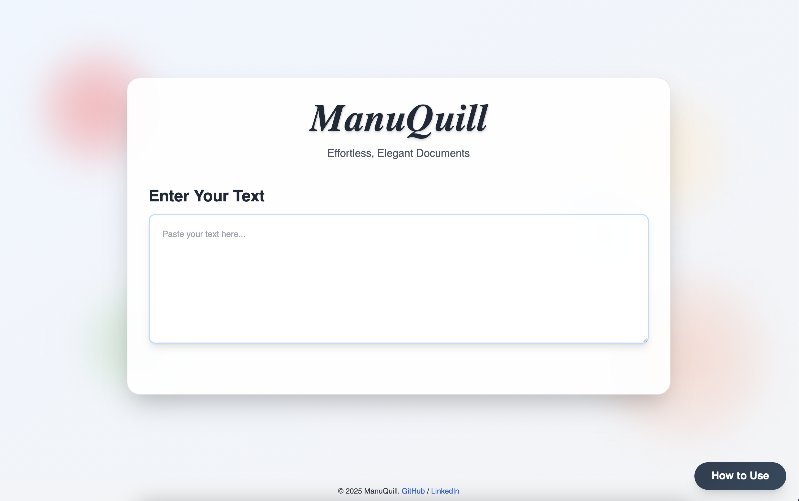
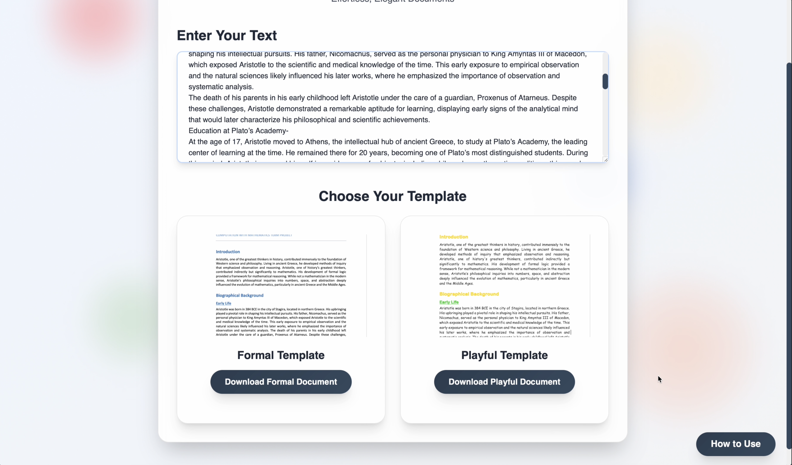

```markdown
# ManuQuill

[](LICENSE)  
[](https://app.netlify.com/sites/YOUR_SITE_NAME/deploys)  
[](https://travis-ci.com/Rishi-Ahuja/manuquill)

---

## Overview

ManuQuill is a modern web application that transforms raw text into beautifully formatted documents. With its sleek glassmorphism interface and dynamic, floating color orbs, ManuQuill brings elegance and efficiency to document creation.

---

## Features

- **Automated Text Analysis**  
  Seamlessly converts unstructured text into a polished, professional document.

- **Dynamic Template Selection**  
  Choose from multiple visually distinct templates to match the desired tone.

- **Modern UI/UX**  
  Enjoy a responsive and aesthetically pleasing interface built with advanced CSS effects.

- **Effortless Deployment**  
  Continuously deployed via GitHub Pages and Netlify for a smooth, up-to-date user experience.

- **Scalable & Customizable**  
  Designed to grow with your needs, making document generation both powerful and flexible.

---

## Screenshots

<div align="center">
  <br>
  <em>The home screen where you input raw text.</em>
</div>

<div align="center" style="margin-top: 20px;">
  <br>
  <em>Select your desired document template.</em>
</div>


---

## Install Dependencies

```bash
npm install
# or
yarn install
```

---

## Configure Environment Variables

Create a `.env` file in the root directory and add your API keys (do not commit sensitive information):

```env
API_KEY=your_api_key_here
```

---

## Running Locally

Start the development server:

```bash
npm start
# or
yarn start
```

Open [http://localhost:3000](http://localhost:3000) in your browser to see ManuQuill in action.

---

## Building for Production

Generate a production-ready build:

```bash
npm run build
# or
yarn build
```

The output will be placed in the `build` folder.

---

## Deployment

### GitHub Pages

**Set the Homepage Field (Optional):**

In your `package.json`, add:

```json
"homepage": "https://Rishi-Ahuja.github.io/manuquill"
```

**Deploy using gh-pages:**

- **Install gh-pages:**

  ```bash
  npm install --save-dev gh-pages
  ```

- **Add these scripts to your `package.json`:**

  ```json
  "scripts": {
    "predeploy": "npm run build",
    "deploy": "gh-pages -d build"
  }
  ```

- **Deploy:**

  ```bash
  npm run deploy
  ```

### Netlify

The repository is connected to Netlify. With every push to the main branch, Netlify automatically triggers a build with:

- **Build Command:** `npm run build`
- **Publish Directory:** `build`

If needed, update environment variables or build settings in the Netlify dashboard under **Site Settings > Build & Deploy > Environment**.

---

## Contributing

Contributions, feedback, and bug reports are welcome! Please open an issue or submit a pull request if you have suggestions or improvements.

---

## License

This project is licensed under the MIT License. See the `LICENSE` file for more details.

---

## Contact

For any questions, feature requests, or bug reports, please reach out at:

- **Email:** [rishiahuja.1404@gmail.com](mailto:rishiahuja.1404@gmail.com)
- **GitHub Issues:** [Raise an issue](https://github.com/Rishi-Ahuja/manuquill/issues)

---

*Happy Document Crafting!*
```
